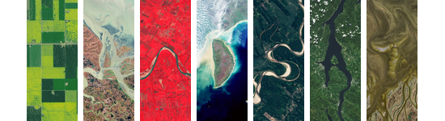
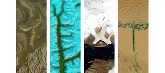
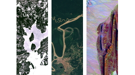

<p align="center">
  <br/>
  <br/>
  
</p>

# landsat-text-api
Render any text using NASA's landsat satellite images!

## Quick start
Make sure you have [bun](https://bun.com/docs/installation) installed.

```bash
bun install
bun run dev
```

## Endpoints

- `GET /api/health` — checks if the service is up
- `GET /api/capture?text=NASA` — returns JSON metadata
- `GET /api/capture.png?text=NASA` — returns PNG
- `POST /api/capture` — same as GET but with JSON body `{"text": "nasa"}`

## Example

```bash
curl "http://localhost:3000/api/capture.png?text=nasa" -o landsat-nasa.png
```

## Working

- Look up each letter in the dataset and builds a local JSON.
- Fetch the letter images from NASA's CDN and downloads them as cache on first startup.
- Renders them using TypeScript.

Each letter can have a few variants provided by NASA so the same input picks the same set of variants

## Commands

- `bun run dev` — start server with watch
- `bun run start` — run server

And that's all!
